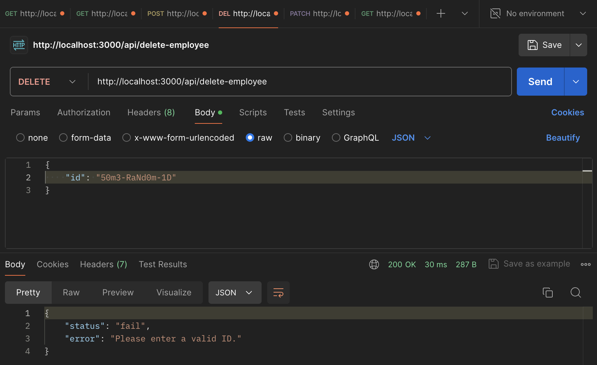

# Rulerise Developer Task

by Kabir Bose

# Technical Choices

I decided to go with JavaScript (Node.js) along with Express.js to build the API. I'm very familiar with it and it has a lot of great features for error-handling.

# Usage

This is a REST API consisting of different endpoints that complete different tasks. I will outline the purpose of each endpoint and provide a guide on how to use them.

The endpoints are:

1. `/api/show-employees`
2. `/api/show-employee`
3. `/api/add-employee`
4. `/api/delete-employee`
5. `/api/update-employee`
6. `/api/admin/show-roles`

# Guide

### Show Employees

The endpoint `/api/show-employees` displays all the employees in the organization along with their respective data (name, role, and status). When fetched, it performs a `GET` request and outputs every single employee that is stored in the database.
 

Check the attached image. If you take a look at the _Body_ section, you will see the response of _200 OK_, status of _success_, and the data consisting of an array of each employee. Each employee has a firstname, lastname, role, status, and ID.
 

Now what if there are no employees? The response will still be successful with _200 OK_, however the data in the body will say _There are no employees._

Any errors will also be handled gracefully with the appropriate response code of _400_, since client-side errors won't be possible on this endpoint.

### Show Employee

The endpoint `/api/show-employee` displays a single employee given their ID, or multiple employees if they have the same first or last name. Admins can choose what information to send to the server, either firstname, lastname, ID or all. However, since IDs are unique, if an admin sends an ID along with the names in the payload, only one user will be displayed. This endpoint performs a `GET` request.
 

In this image an ID is sent as the payload, and in the body you can see that a single employee is displayed. This is because the ID is unique to each employee so only one employee will be displayed.
 

Unlike the ID, names don't have to be unique. In this case, Mr. Krabs and his daughter Pearl have the same last name, _Krabs_. So when their lastname is sent as the payload, both Mr. Krabs and Pearl are queried from the database and displayed.
 

These are the error cases. If an invalid ID, firstname, or lastname is sent in the payload, the response would let the user know that they are sending incorrect information.

### Add Employee

The endpoint `/api/add-employee` performs a `POST` request using the following payload of: firstname, lastname, status, and role. All of these fields are required in the payload or a validation error will occur.
 

In this image, you can see that a new user was created and added to the database. If you perform a `GET` request on the employee, you will see that they populate the database.
 

If you forget to add a required field, an error message will be displayed. You will be reminded to enter a firstname, lastname, role, and status before you can add the employee to the database.
 

If you enter a role or status that does not exist, an error message will be displayed as well. You will be reminded to enter a valid role or status before you can add the employee to the database. The valid roles and status's will be displayed in the error message.

### Delete Employee

The endpoint `/api/delete-employee` performs a `DELETE` request and deletes an employee from the database given a valid ID.
 

On successful deletion of an employee, this is the response.
 

If an invalid ID is entered (the user does not exist) or any other error occurs, a short and informative error message is outputted reminding the user to enter a valid ID.

### Update Employee

The endpoint `/api/update-employee` performs a `PATCH` request and updates an employee given their ID. You would need to provide a payload of a valid employee ID and whatever fields you want to update. Once you send the request, you can perform a `GET` request to verify they have been updated.
 

Here you can see a valid response for when the employee is updated. The status of the employee has been changed from employed to fired.
 

If I perform a `GET` request on the user, I can see that they are now fired instead of employed. You can update many fields at the same time.
 

If you enter an invalid ID (the user does not exist), you will see an error message reminding you to enter a valid employee ID.

### Show Roles

The endpoint `/api/admin/show-roles` performs a `GET` request and provides an output consisting of the following information: total employees and total roles.
 

Here you can see all the information once you perform a `GET` request.
