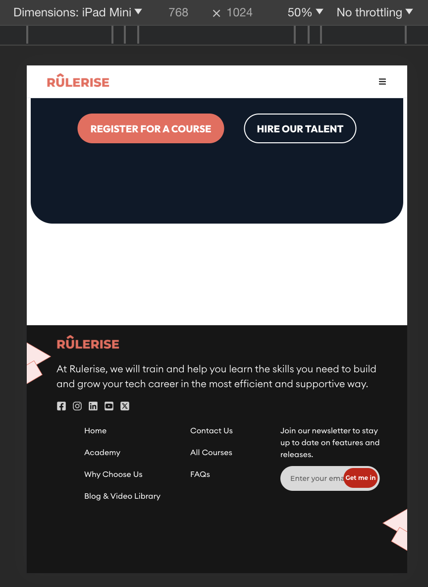

Some things to fix:

1. On medium sized displays, some elements break and aren't very responsive

Attached below is an image of an element that breaks when used on devices with a medium viewport (like an iPad Mini). The text-box for the mailing list breaks. It could easily be fixed using CSS Flexbox and placing the item below the links. There are other examples of items breaking on medium viewport or not taking advantage of the display as well.

 

2. On the _Home_ page, if the courses were laid out side by side like how they were on the _Academy_ page, it would ensure consistency, be more noticable at quick glace, as well as allow users to compare courses side by side. Since there are only 3 courses, the slider element may not make sense.

